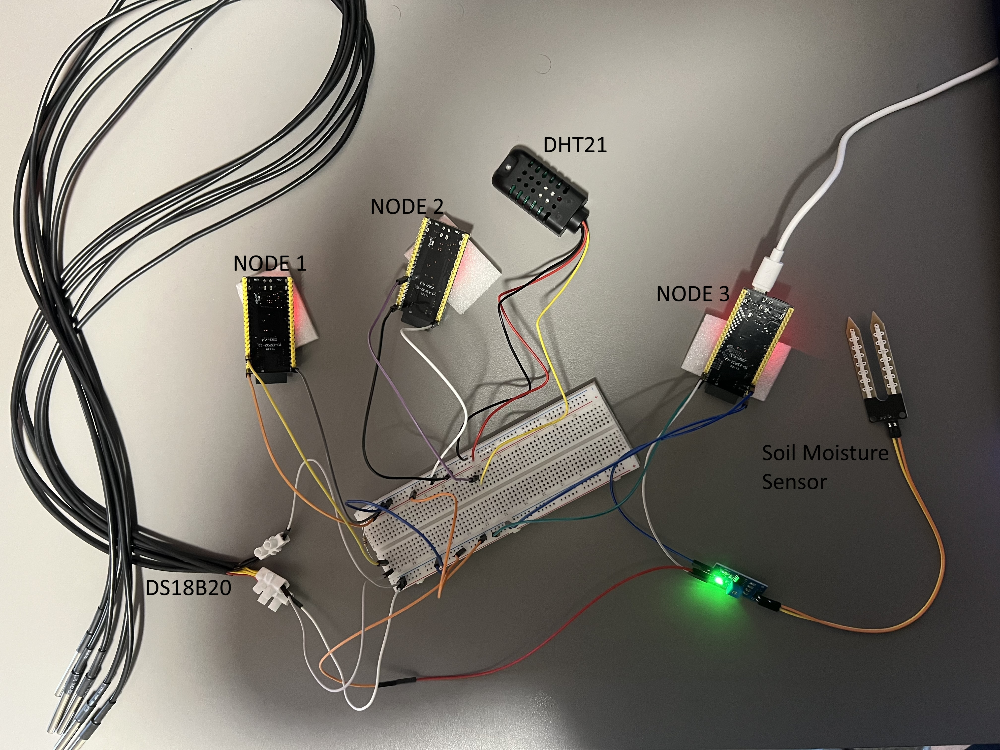

# ESP32 Mesh MQTT Monitoring System

A mesh-networked sensor system built on ESP32-S3 N16R8 boards using painlessMesh. Sensor data is collected across three nodes and forwarded to an MQTT broker via the gateway node.

---

## System Architecture

```
┌─────────────────┐              ┌─────────────────┐
│   Node 1        │              │   Node 2        │
│   5× DS18B20    │◄────mesh────►│   DHT21         │
│   every 5s      │              │   every 30s     │
└────────┬────────┘              └────────┬────────┘
         │              mesh              │
         └──────────────┬─────────────────┘
                        ▼
             ┌─────────────────┐
             │    Gateway      │
             │    Node 3       │
             │  Soil moisture  │
             │  WiFi + MQTT    │
             └────────┬────────┘
                      │ MQTT / TCP
                      ▼
             ┌─────────────────┐
             │   MQTT Broker   │
             │ broker.hivemq   │
             │   .com          │
             │   port 1883     │
             └─────────────────┘
```

---

## Hardware Prototype

The physical prototype was tested with three ESP32-S3 boards, five DS18B20 temperature probes, one DHT21 humidity/temperature sensor and one analog soil moisture sensor.



## Hardware

| Component | Model | Qty |
|---|---|---|
| Microcontroller | ESP32-S3 N16R8 | 3 |
| Temperature sensor | DS18B20 | 5 |
| Humidity + temperature sensor | DHT21 / AM2301 | 1 |
| Soil moisture sensor | Analog soil moisture sensor module | 1 |
| Pull-up resistor | 4.7kΩ | 1 |

### Pin Connections

| Node | Component | Connection |
|---|---|---|
| Node 1 | DS18B20 data bus (×5, parallel) | GPIO 4 |
| Node 2 | DHT21 data | GPIO 15 |
| Gateway | Soil sensor analog out | GPIO 1 |
| Gateway | Soil sensor VCC | 3V3 |
| Gateway | Soil sensor GND | GND |

> DS18B20 data bus requires a 4.7kΩ pull-up resistor between DATA and 3V3.  
> DHT21 may require a pull-up resistor depending on the module used.

---

## Software

- PlatformIO + Arduino framework
- painlessMesh
- ArduinoJson
- PubSubClient
- OneWire + DallasTemperature
- DHT sensor library

### Project Structure

```
esp32_mesh_mqtt_monitoring_system/
├── platformio.ini
└── src/
    ├── node1_ds18b20.cpp
    ├── node2_dht21.cpp
    └── node3_gateway.cpp
```

---

## Configuration

### Mesh (all three nodes)

```cpp
#define MESH_PREFIX   "MonitoringSystem"
#define MESH_PASSWORD "meshpass2003"
#define MESH_PORT     5555
#define MESH_CHANNEL  9
```

> All nodes must use the same `MESH_PREFIX`, `MESH_PASSWORD`, `MESH_PORT` and `MESH_CHANNEL`.  
> Channel 9 was selected because the gateway Wi-Fi hotspot was operating on channel 9 during testing. This value must match the Wi-Fi AP channel used by the gateway. If the gateway is connected to another Wi-Fi network, this value may need to be measured again and updated on all nodes.

### MQTT (gateway only)

```cpp
#define MQTT_SERVER  "YOUR_MQTT_BROKER"
#define MQTT_PORT    1883
#define MQTT_TOPIC   "YOUR_MQTT_TOPIC"
```

During testing, the public HiveMQ broker was used:
- Broker: `broker.hivemq.com`
- Port: `1883`
- Topic: `monitoring/sensors`

For a different MQTT platform, update the broker address, port, topic and credentials if required.

---

## MQTT Message Format

### Node 1 — Temperature (every 5 seconds)

```json
{
  "node": 1,
  "type": "temperature",
  "values": [23.87, 24.06, 24.06, 24.37, 24.00],
  "validCount": 5,
  "uptimeSec": 35
}
```

`values` — 5-element array, index-fixed. `null` if a sensor is disconnected.  
`validCount` — number of sensors that returned a valid reading.

### Node 2 — Humidity + Temperature (every 30 seconds)

```json
{
  "node": 2,
  "type": "humidity_temp",
  "temperature": 25.50,
  "humidity": 47.3,
  "uptimeSec": 90
}
```

### Gateway — Soil Moisture (every 30 seconds)

```json
{
  "node": 3,
  "type": "soil_moisture",
  "raw": 2100,
  "moisture": 62.3,
  "uptimeSec": 180
}
```

`raw` — ADC value (0–4095).  
`moisture` — percentage calculated from calibration constants. The current dry/wet calibration constants are example values and should be adjusted after measuring the sensor in dry and wet soil.

---

## Setup

1. Set WiFi credentials and MQTT broker in `src/node3_gateway.cpp`:

```cpp
#define WIFI_SSID  "YOUR_WIFI_SSID"
#define WIFI_PASS  "YOUR_WIFI_PASSWORD"
#define MQTT_SERVER  "YOUR_MQTT_BROKER"
```

2. Set `MESH_CHANNEL` to match your WiFi AP channel in all three source files.

3. Select the environment in PlatformIO and upload to each board:

```
env:node1_ds18b20  →  Node 1
env:node2_dht21    →  Node 2
env:node3_gateway  →  Gateway
```

> COM ports are machine-specific. If PlatformIO does not detect the port automatically, set `upload_port` and `monitor_port` manually under the relevant environment in `platformio.ini`:
> ```ini
> upload_port = COM7
> monitor_port = COM7
> ```

---

## Test Results

Tested with all three nodes running simultaneously. Gateway Serial Monitor output:

```
[Gateway] Starting...
[Gateway] Ready.
[Gateway] WiFi connected. IP: 172.20.10.2
[Gateway] MQTT connected.
[Gateway] New connection, nodeId=2717083520
[Gateway] New connection, nodeId=3565059652

[Gateway] Received from node 2717083520: {"node":1,"type":"temperature","uptimeSec":35,"values":[23.87,24.06,24.06,24.37,24.00],"validCount":5}
[Gateway] MQTT publish OK: {"node":1,"type":"temperature","uptimeSec":35,"values":[23.87,24.06,24.06,24.37,24.00],"validCount":5}

[Gateway] Received from node 3565059652: {"node":2,"type":"humidity_temp","temperature":25.50,"humidity":47.3,"uptimeSec":90}
[Gateway] MQTT publish OK: {"node":2,"type":"humidity_temp","temperature":25.50,"humidity":47.3,"uptimeSec":90}

[Gateway] Soil read: raw=4095 moisture=0.0%
[Gateway] MQTT publish OK: {"node":3,"type":"soil_moisture","raw":4095,"moisture":0.0,"uptimeSec":180}
```

> Soil moisture calibration is approximate and should be adjusted using dry and wet reference measurements with the actual sensor.

---

## Notes

- All ESP32 nodes must use the same `MESH_PREFIX`, `MESH_PASSWORD`, `MESH_PORT` and `MESH_CHANNEL`.
- `MESH_CHANNEL` must match the Wi-Fi AP channel used by the gateway.
- Wi-Fi credentials are only required on the gateway node.
- MQTT publishing is handled only by the gateway node.
- COM ports are not fixed and may change between computers.
